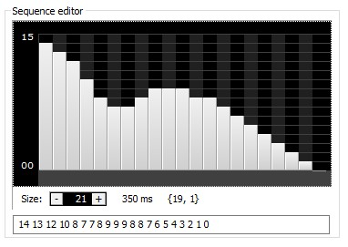
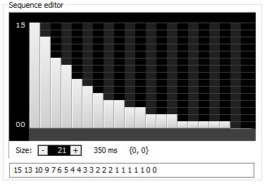
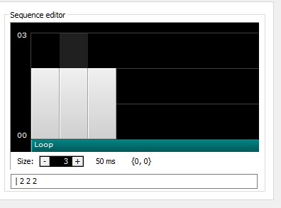
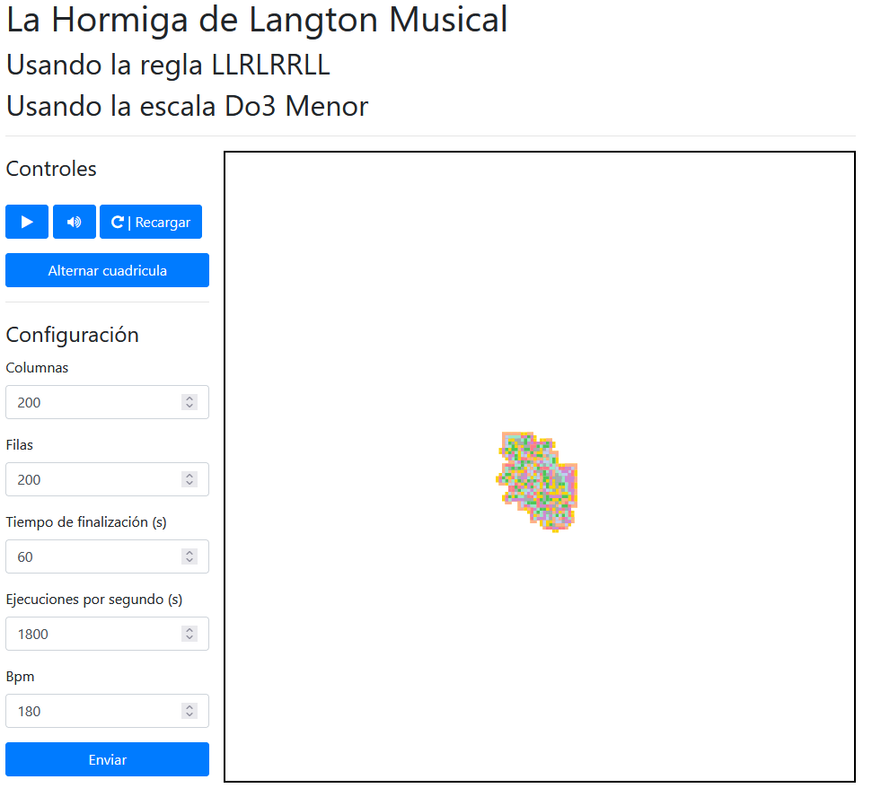

# La Hormiga Musical
Por Luis Vijande Gonzáles
UO275739
**"La Hormiga Musical" (2023)**, es una proyecto de software que consiste en juntar música generada de forma procedural con un autómata celular llamado la Hormiga de Langton.

## Explicación
En los siguientes apartados se explicará que es la hormiga y como se ha integrado con música
### La Hormiga de Langton
La Hormiga es un autómata celular muy simple, tenemos una "hormiga" que está en una cuadricula de tamaño arbitrario, cuando el autómata empieza, la hormiga pone encima de la cuadricula un color elegido en base a las reglas escogidas, si es R la hormiga girará hacia la derecha, si es L, girará hacia la izquierda, después de girar avanzará hacia adelante y después se repetirá el anterior paso hasta que llegue a una celda por la que ya haya pasado, una vez que esté en esa celda se aplicará la siguiente regla y este proceso se repite hasta que se alcance el objetivo, que en este caso es que la hormiga choque contra un muro o que pase el tiempo especificado.
### Integración con audio
Primero se escoge la escala, para escoger la escala nos basamos en la regla, si la regla tiene más Rs que Ls se escoge la escala mayor, si no la menor.

Cada $n$ frames, se coge el índice de la última regla que ha sido ejecutada y se ejecutará la nota que tenga el mismo índice, la cantidad de frames que hay que esperar depende de los beats por segundo siguiendo $B$, la ecuación es la siguiente:
$$n = \frac{\text{FPS}}{B / 60}$$
Una vez hayan pasado $n$ frames se recoge la regla y se reproduce el sonido.

#### Creación de audio
Todos los archivos de audio se han creado usando [FamiTracker](http://famitracker.com/), se han creado 16 archivos WAV, 8 para la escala mayor en do3 en Pulse1 usando este envelope

y los otros 8 para la escala menor en do3 en Triangle usando este envelope  
  
y este Duty/Noise   



Se han usado distintos envelopes y instrumentos para dar algo más de variación al sonido.


## Aplicación
El proyecto consiste en una página web creada usando JavaScript, HTML5, CSS y JQuery, la página web está montada encima de un servidor de [Node](https://nodejs.org/es/) usando [Express](https://expressjs.com/es/), y el servidor a su vez está montado encima de una app de [Electron](https://www.electronjs.org/es/) para que sea una aplicación de escritorio en vez de una página web.

La aplicación en si misma consiste en una interfaz creada con HTML y CSS usando [Bootstrap](https://getbootstrap.com/) para parte de el estilado y se ha usado [Font Awesome](https://fontawesome.com/)  y un canvas que hace uso de [p5.js](https://p5js.org/), para la reproducción de sonido se ha usado p5.sound.js.
### Ejecución
Para ejecutar la aplicación es necesario tener Node instalado y ejecutar los siguientes comandos en el directorio donde se encuentre el código fuente
```bash
npm install
npm start
```
Estos comandos instalarán las dependencias y ejecutarán la aplicación, es importante decir que se requiere conexión a internet ya que se importa tanto JQuery, como Boostrap, como Font Awesome por medio de cdn.
### Interfaz

La interfaz consiste en:
- el titulo y la información sobre la hormiga y audio que se está ejecutando 
- un panel de control que permite parar la ejecución, quitar el sonido, recargar la página para crear una nueva hormiga y alternar la visualización de la cuadricula.
- Un formulario para configurar la hormiga, permite cambiar el número de celdas, el tiempo de finalización, las ejecuciones de la función step de la hormiga y el bpm


